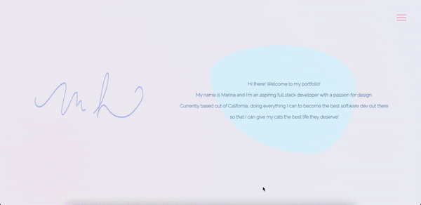

## hw_newPortfolio

## Table of Contents 📚

- [Description](#description)
- [Preview](#preview)
- [Usage](#usage)
- [Links](#links)

## Description 📋

Updated portfolio, building off of each previos version through the course. 

## Preview 📸

## Usage 🖥

Send out to prospective employers, continue to add to site with updated projects and skills.

## Links 💾

**[GitHub Link ✨](https://github.com/mxhuisken/hw_newPortfolio)**

**[Deployed Link ✨](https://mxhuisken.github.io/hw_newPortfolio/)**
